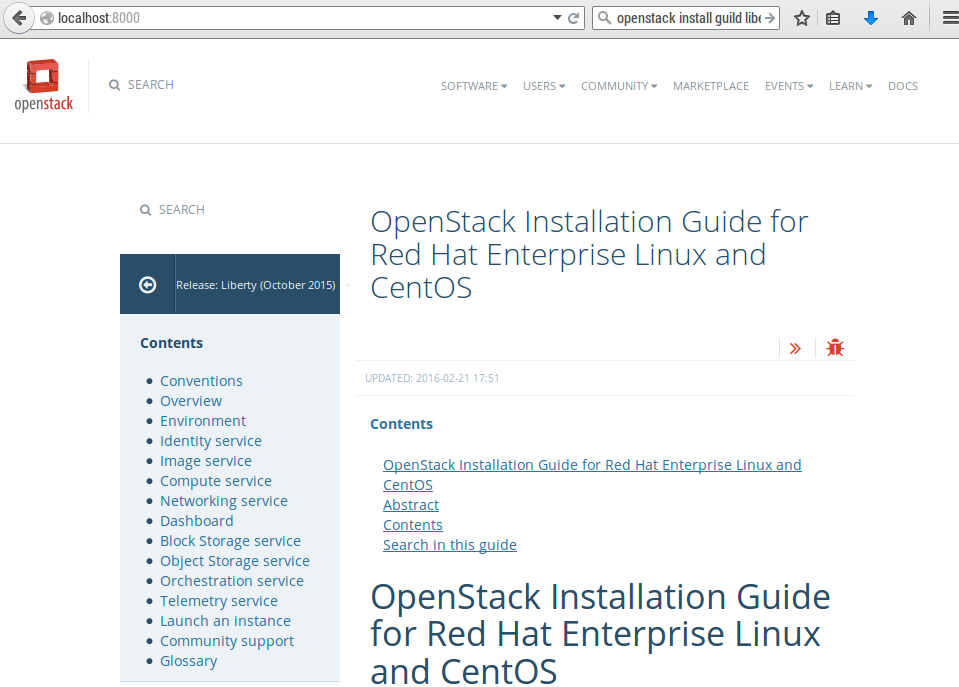

ติดตั้ง Openstack
##############

เตรียมพร้อมเอกสาร

.. code-block:: bash
    :linenos:

    pip install tox
    git clone https://github.com/openstack/openstack-manuals
    cd openstack-manuals
    tox -e docs
    ls doc
    admin-guide-cloud  arch-design-draft  common            contributor-guide  image-guide    networking-guide  user-guide
    arch-design        cli-reference      config-reference  glossary           install-guide  pom.xml           user-guide-admin

    cd doc/install-guide/build-rdo/htmldoc/install-guide/build-rdo/html
    python -m SimpleHTTPServer

เปิด brower ไปยัง port 8000

